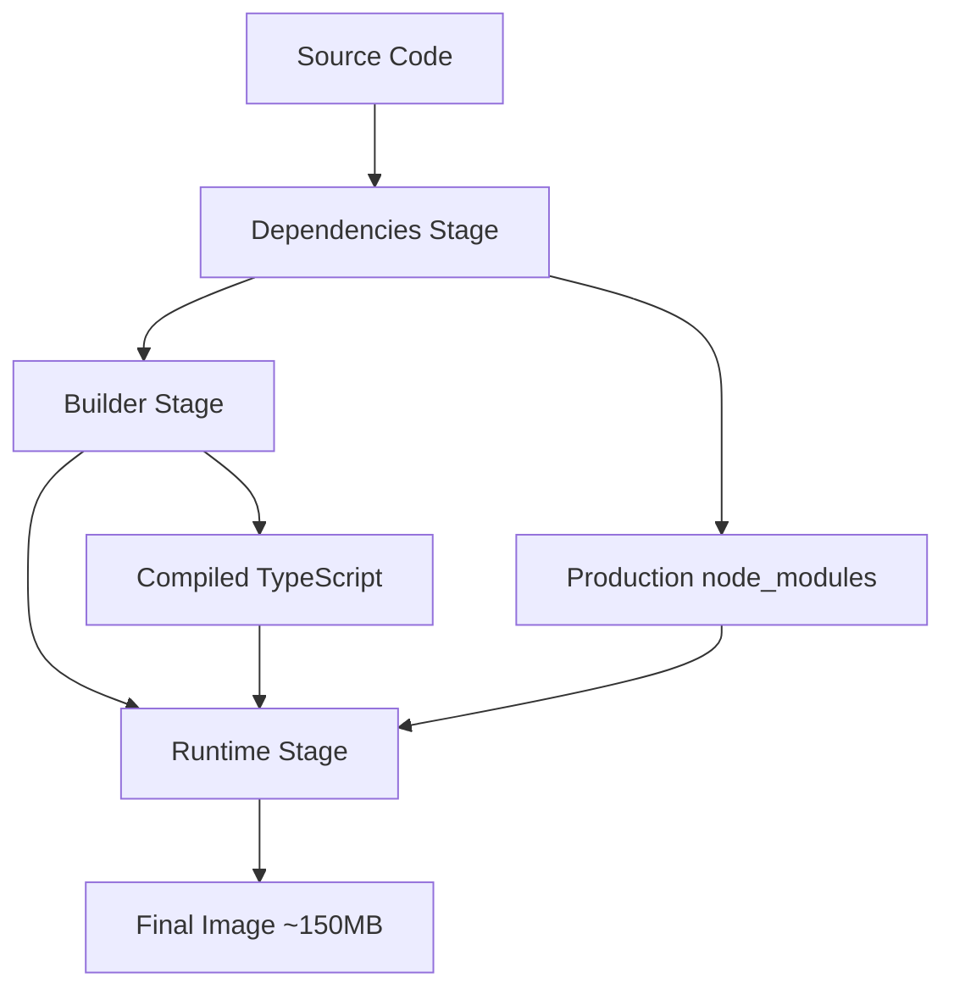

# MCP Server - Docker Setup Guide

An intelligent MCP (Model Context Protocol) router that aggregates and serves multiple MCP resource servers through a single interface. This server acts as a central hub with AI-powered server selection and LRU caching for optimal performance.

## Quick Start with Docker

### Prerequisites

- Docker and Docker Compose installed
- OpenAI API key
- Available ports: 9999 (server)

### Basic Docker Commands

```bash
# Build the server image
docker build -t metis-server ./server

# Run standalone container
docker run -d \
  --name metis-server \
  -p 9999:9999 \
  -e OPENAI_API_KEY=your_api_key_here \
  -v $(pwd)/server/mcp-registry.json:/app/mcp-registry.json \
  -v $(pwd)/server/config.json:/app/config.json \
  -v $(pwd)/server/generated:/app/generated \
  -v ~/.mcp-auth:/root/.mcp-auth \
  metis-server

# Check container health
docker ps
docker logs metis-server
```

### Using Docker Compose (Recommended)

```bash
# Start all services (server, backend, frontend)
docker-compose up -d

# Start only the server
docker-compose up -d server

# View logs
docker-compose logs -f server

# Stop services
docker-compose down
```

## Docker Architecture

### Multi-Stage Dockerfile Structure

The server uses a 3-stage Docker build for optimal performance:

#### Stage 1: Dependencies (`deps`)
- **Base**: `node:18-alpine`
- **Purpose**: Install and cache production dependencies
- **Optimization**: Separate layer for package.json changes
- **Security**: Includes `dumb-init` for proper signal handling

#### Stage 2: Builder (`builder`)
- **Base**: `node:18-alpine`
- **Purpose**: TypeScript compilation and build process
- **Process**: Installs all dependencies (including dev) and runs `npm run build`
- **Output**: Compiled JavaScript in `/app/build` directory

#### Stage 3: Runtime (`runtime`)
- **Base**: `node:18-alpine`
- **Purpose**: Minimal production runtime environment
- **Security**: Non-root user (`mcp:nodejs`)
- **Health**: Built-in health checks
- **Size**: ~150MB (optimized)

### Build Process Flow



## Environment Configuration

### Shared Environment Variables

The server reads from the root `.env` file (not `server/.env`):

```bash
# Required
OPENAI_API_KEY=sk-your_openai_api_key_here

# Server Configuration
MAX_ACTIVE_SERVERS=3
SERVER_PORT=9999
NODE_ENV=production

# Optional
LOG_LEVEL=info
CACHE_SIZE=100
REQUEST_TIMEOUT=30
```

### Docker Environment Injection

Environment variables are automatically injected into the container:

```yaml
# docker-compose.yml
services:
  server:
    env_file:
      - .env  # Root environment file
    environment:
      - NODE_ENV=production
      - PORT=9999
```

## Volume Mounting Strategy

### Persistent Data Volumes

The server requires several bind mounts for persistent data:

```yaml
volumes:
  # MCP Server Registry (all available servers)
  - ./server/mcp-registry.json:/app/mcp-registry.json
  
  # Active Server Configuration (LRU cache)
  - ./server/config.json:/app/config.json
  
  # AI-Generated Data (embeddings, summaries)
  - ./server/generated:/app/generated
  
  # Authentication Credentials
  - ~/.mcp-auth:/root/.mcp-auth
```

### Volume Purposes

| Volume | Purpose | Persistence | Size |
|--------|---------|-------------|------|
| `mcp-registry.json` | Master server registry (1000+ servers) | Required | ~500KB |
| `config.json` | Active server cache (LRU) | Required | ~50KB |
| `generated/` | AI embeddings and summaries | Recommended | ~10MB |
| `~/.mcp-auth` | Server authentication credentials | Required | ~1KB |

### Development Volume Mounts

For development with hot reloading:

```yaml
# docker-compose.dev.yml
volumes:
  - ./server:/app
  - /app/node_modules  # Anonymous volume for node_modules
```

## Health Checks and Monitoring

### Built-in Health Check

The container includes a comprehensive health check:

```dockerfile
HEALTHCHECK --interval=30s --timeout=10s --start-period=5s --retries=3 \
    CMD curl -f http://localhost:9999/health || exit 1
```

### Health Check Endpoint

The server exposes a `/health` endpoint:

```bash
# Check health manually
curl http://localhost:9999/health

# Expected response
{
  "status": "healthy",
  "timestamp": "2024-01-15T10:30:00Z",
  "uptime": 3600,
  "activeServers": 3,
  "maxServers": 3,
  "memoryUsage": {
    "rss": 45678912,
    "heapUsed": 23456789
  }
}
```

### Monitoring Commands

```bash
# Container health status
docker ps --format "table {{.Names}}\t{{.Status}}\t{{.Ports}}"

# Resource usage
docker stats metis-server

# Health check logs
docker inspect metis-server | jq '.[0].State.Health'

# Application logs
docker logs -f metis-server --tail 100
```

## Build Optimization

### Layer Caching Strategy

The Dockerfile is optimized for Docker layer caching:

1. **Package files first**: `COPY package*.json ./`
2. **Dependencies installation**: `RUN npm ci`
3. **Source code last**: `COPY . .`

This ensures dependency layers are cached when only source code changes.

### Build Context Optimization

The `.dockerignore` file excludes unnecessary files:

```
node_modules
build
*.log
.env*
.git
.DS_Store
coverage
*.test.ts
```

### Build Performance Tips

```bash
# Use BuildKit for faster builds
DOCKER_BUILDKIT=1 docker build -t metis-server ./server

# Build with cache from registry
docker build --cache-from metis-server:latest -t metis-server ./server

# Multi-platform builds
docker buildx build --platform linux/amd64,linux/arm64 -t metis-server ./server
```

## Development Workflow

### Development Mode

```bash
# Start with hot reloading
docker-compose -f docker-compose.dev.yml up server

# Or run development server directly
docker run -it --rm \
  -p 9999:9999 \
  -v $(pwd)/server:/app \
  -v /app/node_modules \
  -e NODE_ENV=development \
  metis-server npm run dev:http
```

### Testing in Container

```bash
# Run tests
docker-compose exec server npm test

# Run specific test file
docker-compose exec server npm test -- --match="*proxy*"

# Interactive shell
docker-compose exec server sh
```

### Debugging

```bash
# Enable debug logging
docker-compose up server -e LOG_LEVEL=debug

# Use MCP Inspector
docker-compose exec server npm run inspector

# Attach debugger
docker run -it --rm \
  -p 9999:9999 \
  -p 9229:9229 \
  -v $(pwd)/server:/app \
  metis-server node --inspect=0.0.0.0:9229 build/http-streaming.js
```

## Production Deployment

### Production Build

```bash
# Build production image
docker build --target runtime -t metis-server:prod ./server

# Run production container
docker run -d \
  --name metis-server-prod \
  --restart unless-stopped \
  -p 9999:9999 \
  -e NODE_ENV=production \
  -e OPENAI_API_KEY=your_api_key \
  -v $(pwd)/server/mcp-registry.json:/app/mcp-registry.json \
  -v $(pwd)/server/config.json:/app/config.json \
  -v $(pwd)/server/generated:/app/generated \
  -v ~/.mcp-auth:/root/.mcp-auth \
  metis-server:prod
```

### Production Environment Variables

```bash
# Production .env settings
NODE_ENV=production
LOG_LEVEL=warn
LOG_FORMAT=json
DEBUG=false
MAX_ACTIVE_SERVERS=5
CACHE_SIZE=200
```

### Resource Limits

```yaml
# docker-compose.prod.yml
services:
  server:
    deploy:
      resources:
        limits:
          cpus: '1.0'
          memory: 512M
        reservations:
          cpus: '0.5'
          memory: 256M
```

## Troubleshooting

### Common Issues

#### 1. Container Won't Start

```bash
# Check logs
docker logs metis-server

# Common causes:
# - Missing OPENAI_API_KEY
# - Port 9999 already in use
# - Invalid volume mounts
```

#### 2. Health Check Failing

```bash
# Check health endpoint manually
docker exec metis-server curl -f http://localhost:9999/health

# Common causes:
# - Server not fully started (wait 30s)
# - Missing curl in container (should be installed)
# - Application crashed (check logs)
```

#### 3. Volume Mount Issues

```bash
# Check volume mounts
docker inspect metis-server | jq '.[0].Mounts'

# Common causes:
# - Incorrect file paths
# - Permission issues
# - Files don't exist on host
```

#### 4. Environment Variables Not Loading

```bash
# Check environment variables
docker exec metis-server env | grep -E "(OPENAI|MAX_ACTIVE)"

# Common causes:
# - .env file not in project root
# - Incorrect env_file path in docker-compose.yml
# - Variables not exported in shell
```

### Performance Issues

#### High Memory Usage

```bash
# Monitor memory usage
docker stats metis-server

# Solutions:
# - Reduce MAX_ACTIVE_SERVERS
# - Reduce CACHE_SIZE
# - Add memory limits
```

#### Slow Startup

```bash
# Check startup time
docker logs metis-server | grep -i "server.*listening"

# Solutions:
# - Use smaller base image
# - Optimize dependencies
# - Pre-warm cache
```

### Network Issues

#### Can't Connect to Server

```bash
# Check port binding
docker port metis-server

# Check network connectivity
docker exec metis-server netstat -tlnp

# Test from host
curl http://localhost:9999/health
```

#### Service Discovery Issues

```bash
# Check Docker network
docker network ls
docker network inspect metis-network

# Test inter-service communication
docker exec metis-backend curl http://server:9999/health
```

### Debugging Commands

```bash
# Container information
docker inspect metis-server

# Process list
docker exec metis-server ps aux

# File system
docker exec metis-server ls -la /app

# Network interfaces
docker exec metis-server ip addr show

# Environment variables
docker exec metis-server printenv

# Disk usage
docker exec metis-server df -h
```

## Security Considerations

### Container Security

- **Non-root user**: Container runs as `mcp:nodejs` (UID 1001)
- **Minimal base image**: Alpine Linux for reduced attack surface
- **Signal handling**: `dumb-init` for proper process management
- **Health checks**: Automatic restart on failure

### Secrets Management

```bash
# Use Docker secrets (Swarm mode)
echo "your_api_key" | docker secret create openai_api_key -

# Use environment file
docker run --env-file .env.prod metis-server

# Use external secret management
docker run -e OPENAI_API_KEY="$(vault kv get -field=key secret/openai)" metis-server
```

### Network Security

```yaml
# Restrict network access
services:
  server:
    networks:
      - metis-internal
    ports:
      - "127.0.0.1:9999:9999"  # Bind to localhost only
```

## Advanced Configuration

### Custom Build Arguments

```dockerfile
# Build with custom Node.js version
docker build --build-arg NODE_VERSION=20-alpine -t metis-server ./server
```

### Multi-Architecture Builds

```bash
# Build for multiple architectures
docker buildx create --use
docker buildx build --platform linux/amd64,linux/arm64 -t metis-server ./server --push
```

### Container Registry

```bash
# Tag for registry
docker tag metis-server your-registry.com/metis-server:latest

# Push to registry
docker push your-registry.com/metis-server:latest

# Pull and run
docker run -d your-registry.com/metis-server:latest
```

## Integration with Full Stack

### With Backend and Frontend

```bash
# Start full stack
docker-compose up -d

# Check service connectivity
docker-compose exec backend curl http://server:9999/health
docker-compose exec frontend curl http://backend:8000/health
```

### Service Dependencies

```yaml
# docker-compose.yml
services:
  server:
    # Server starts first
    
  backend:
    depends_on:
      server:
        condition: service_healthy
        
  frontend:
    depends_on:
      backend:
        condition: service_healthy
```

## Maintenance

### Updates and Upgrades

```bash
# Update dependencies
docker-compose exec server npm update

# Rebuild image
docker-compose build server

# Rolling update
docker-compose up -d --no-deps server
```

### Backup and Restore

```bash
# Backup persistent data
tar -czf metis-backup.tar.gz \
  server/mcp-registry.json \
  server/config.json \
  server/generated/ \
  ~/.mcp-auth

# Restore
tar -xzf metis-backup.tar.gz
```

### Log Management

```bash
# Rotate logs
docker-compose logs --no-log-prefix server > server.log
docker-compose restart server

# Configure log rotation
# Add to docker-compose.yml:
logging:
  driver: "json-file"
  options:
    max-size: "10m"
    max-file: "3"
```

## Performance Tuning

### Memory Optimization

```yaml
# docker-compose.yml
services:
  server:
    environment:
      - NODE_OPTIONS="--max-old-space-size=512"
    deploy:
      resources:
        limits:
          memory: 512M
```

### CPU Optimization

```yaml
services:
  server:
    deploy:
      resources:
        limits:
          cpus: '1.0'
    environment:
      - UV_THREADPOOL_SIZE=4
```

### Disk I/O Optimization

```yaml
services:
  server:
    volumes:
      - type: tmpfs
        target: /tmp
        tmpfs:
          size: 100M
```

This Docker setup provides a robust, scalable, and maintainable deployment for the MCP Server component with comprehensive monitoring, security, and troubleshooting capabilities.